# JUTTA LAGANI - E-Commerce Fashion Website

## GitHub Repository (Mandatory)
Repository URL: https://github.com/ghimirehimal/Web-tech

## Live Deployment URL (Mandatory)
Deployed Website URL: Add your Render public URL here (example: https://jutta-lagani-web.onrender.com)
Local Development URL: http://127.0.0.1:5000

## Project Overview
JUTTA LAGANI is a Flask-based e-commerce platform for ethnic footwear and clothing. It includes customer flows (browse, cart, checkout, profile, wishlist, orders) and admin flows (dashboard, products, orders, product management).

## Academic Integrity and External Resources
- This project submission is original coursework.
- No copied template project has been used as final submission.
- External references used for learning/implementation:
  - Flask documentation: https://flask.palletsprojects.com/
  - Flask-Login documentation: https://flask-login.readthedocs.io/
  - Flask-SQLAlchemy documentation: https://flask-sqlalchemy.palletsprojects.com/
  - Bootstrap documentation: https://getbootstrap.com/docs/5.0/getting-started/introduction/
  - Font Awesome icons: https://fontawesome.com/

## Core Features
- User registration, login, logout, and profile management
- Product browsing by category (shoes, clothing)
- Wishlist and shopping cart functionality
- Checkout and order placement flow
- User order history and order detail views
- Admin dashboard and product/order management
- Responsive UI for desktop and mobile screens

## Product Catalog Snapshot
- Total seeded products: 42
- Shoes products: 21
- Clothing products: 21
- Product cards display internet-hosted photos with fallback support

## Latest Fixes (February 27, 2026)
- Landing page featured products now show 5 items at a time.
- Navigation links for Home, Shop, Categories, About, and Contact are wired correctly.
- Contact form now handles POST submission and returns a success flash message.
- Product image rendering now supports internet image URLs and safe local fallback images.
- Placeholder images were removed across key pages (home, shop, product detail, cart, checkout, wishlist, orders, profile, admin products).
- Product seed data now includes 42 products total (21 shoes + 21 clothing), including 20 newly added items.
- Startup and seed flows were hardened so products reliably appear after app start/deploy.

## Tech Stack
- Backend: Python, Flask, Flask-SQLAlchemy, Flask-Login, Flask-Bcrypt
- Frontend: HTML, CSS, JavaScript, Bootstrap 5, Jinja2
- Database: SQLite (local), PostgreSQL (Render production)

## Project Structure
```text
Assignment Python Code/
|- app.py
|- config.py
|- models.py
|- wsgi.py
|- requirements.txt
|- Procfile
|- render.yaml
|- README.md
|- templates/
|- static/
|- instance/
`- ss/
```

## Setup and Run Instructions
1. Clone repository
```bash
git clone https://github.com/ghimirehimal/Web-tech.git
cd "Assignment Python Code"
```

2. Create and activate virtual environment
```bash
python -m venv venv
venv\Scripts\activate
```

3. Install dependencies
```bash
pip install -r requirements.txt
```

4. Run the application
```bash
python app.py
```

5. Open browser
```text
http://127.0.0.1:5000
```

## Render Deployment (Production)
This repository is now prepared for Render with:
- `wsgi.py` production entrypoint
- `Procfile` using Gunicorn (`wsgi:app`)
- `render.yaml` blueprint for web service + PostgreSQL
- PostgreSQL driver included in `requirements.txt`

### Deploy Steps on Render
1. Push latest code to GitHub (already done).
2. In Render dashboard, click `New +` then `Blueprint`.
3. Connect repo `ghimirehimal/Web-tech`.
4. Select this project folder and apply the `render.yaml` config.
5. Wait for build and deploy to complete.
6. Copy Render public URL and paste it in this README under `Deployed Website URL`.

### First Run Note
- Database tables are auto-created on startup via `wsgi.py`.
- Set a strong `SECRET_KEY` in Render environment (blueprint generates one).

## Admin Login
- Email: admin@jutta-lagani.com
- Password: admin123

## Testing Notes
- Validate all major user flows: register/login, browse, cart, checkout, orders
- Validate admin flows: dashboard, products, add/edit/delete product, orders
- Test responsive layout on mobile viewport
- Test in multiple browsers before final submission

## Version Control Status
- Git is used for version control with `.gitignore` included.
- Assignment requires 15-20 commits with clear development history.
- Current branch history should be increased to meet final submission requirement.

## Screenshots (Mandatory)
All screenshots are stored in the `ss/` folder and embedded below.

### Latest Desktop Screenshots (Updated Catalog)

#### 1. Homepage
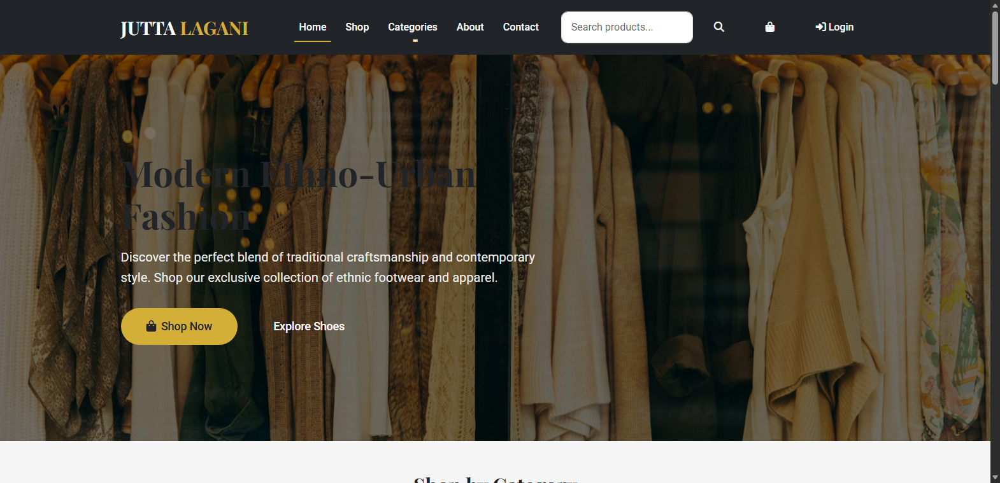

#### 2. Shop - All Products


#### 3. Shop - Shoes Category
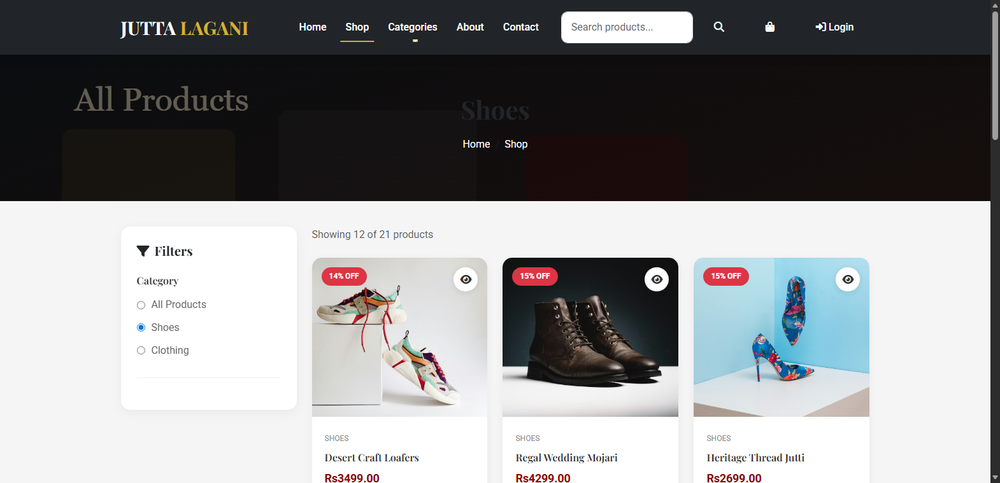

#### 4. Shop - Clothing Category
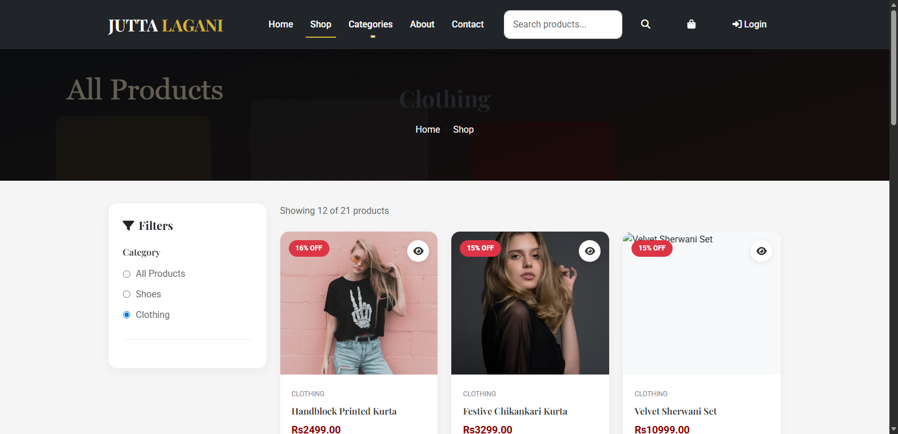

#### 5. Product Detail - Shoe
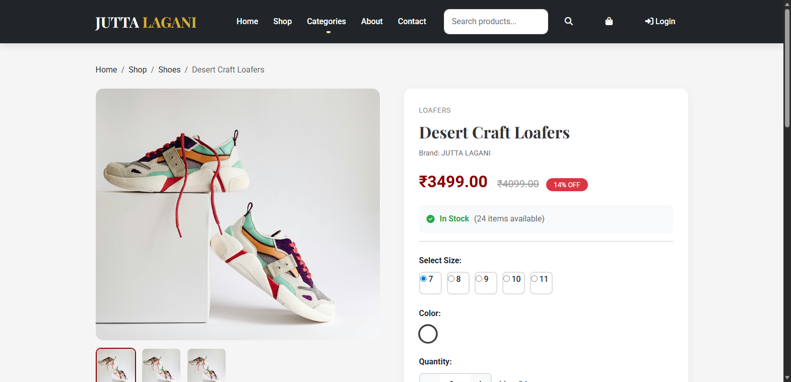

#### 6. Product Detail - Clothing
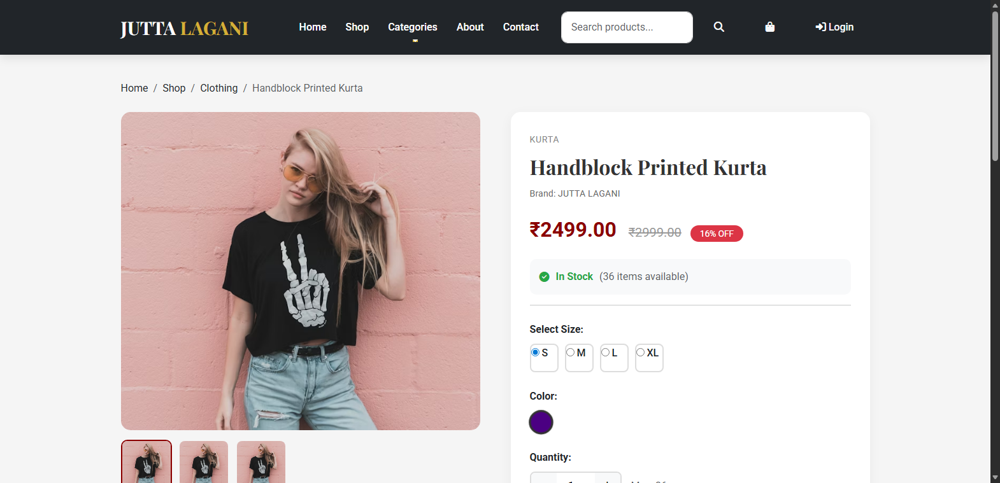

#### 7. About Page
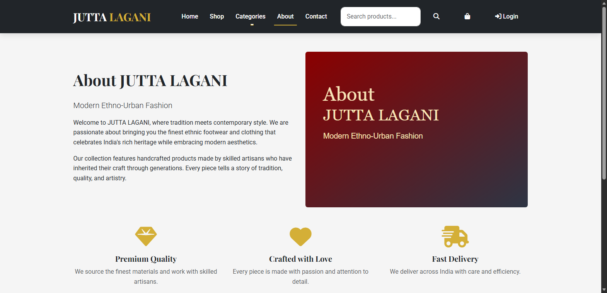

#### 8. Contact Page
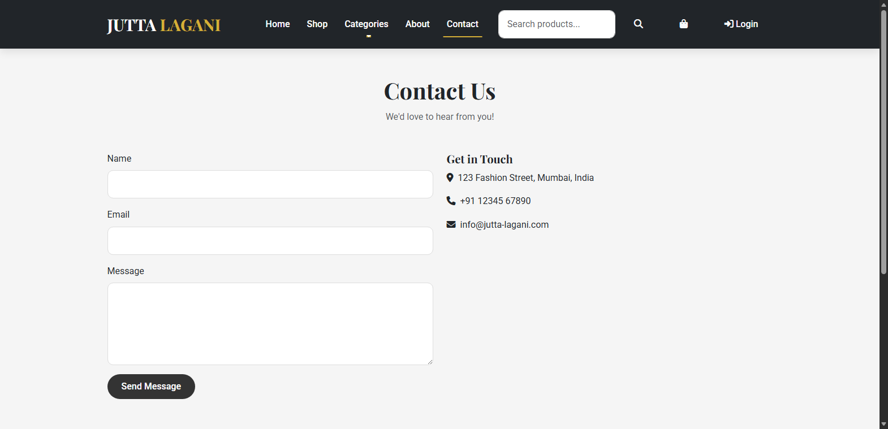

#### 9. Login Page
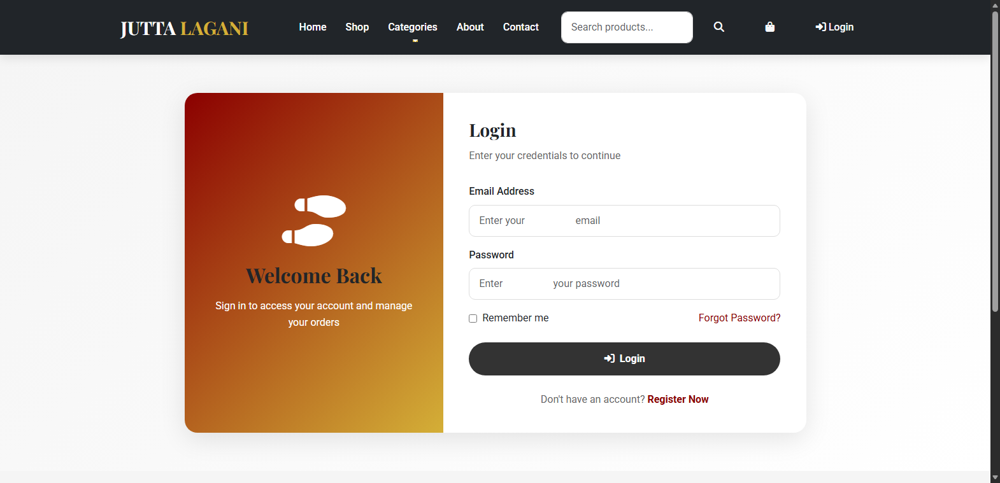

#### 10. Admin Dashboard
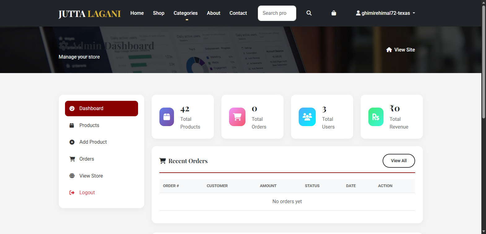

#### 11. Admin Products
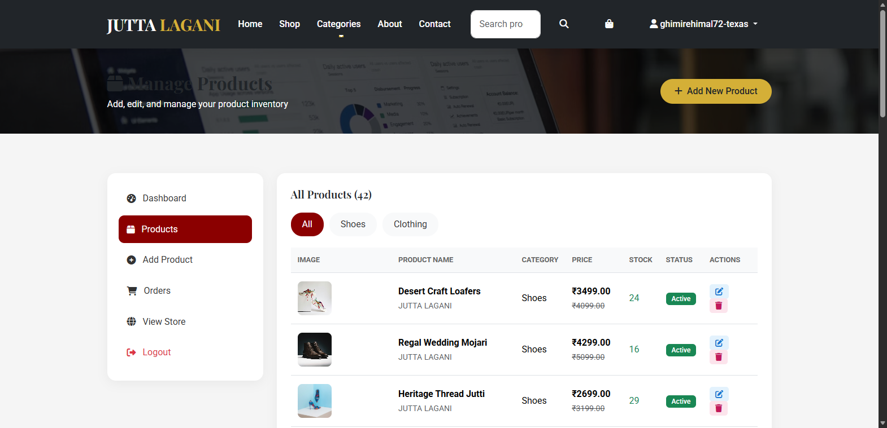

### Latest Mobile Responsive Screenshots

#### 12. Mobile Homepage
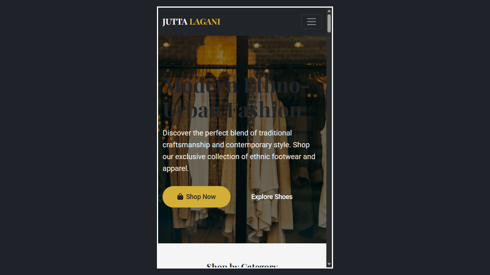

#### 13. Mobile Shop - Shoes
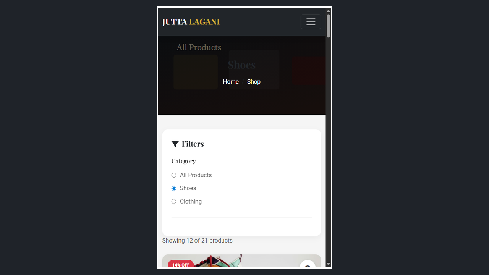

#### 14. Mobile Shop - Clothing


#### 15. Mobile Contact
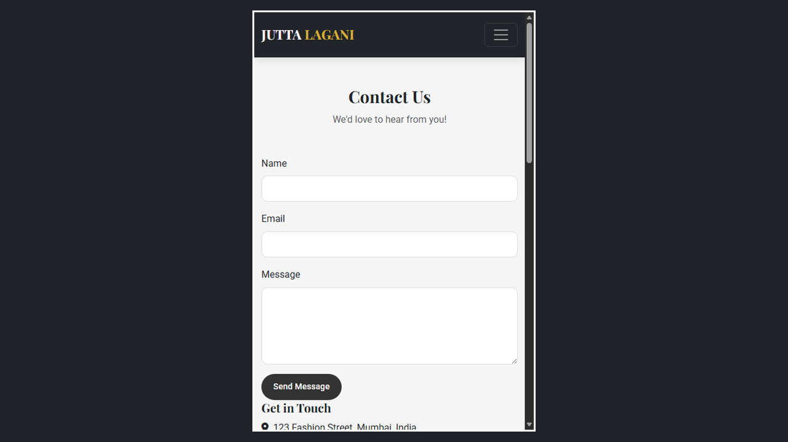

#### 16. Mobile Navigation Open
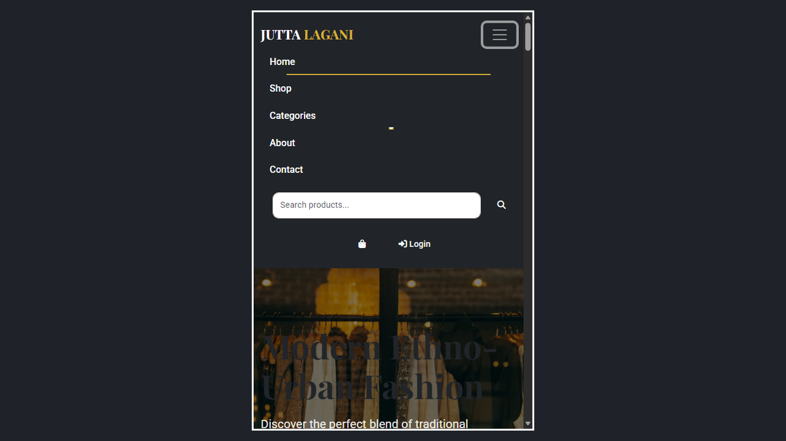

## Submission Checklist
- Public GitHub repository provided
- README.md included with setup steps
- Screenshots included in README and labeled
- Mobile responsive screenshots included
- Deployment URL section included (update with live URL)
- Ready to include repository URL on documentation cover page

## Author
Himal Ghimire
